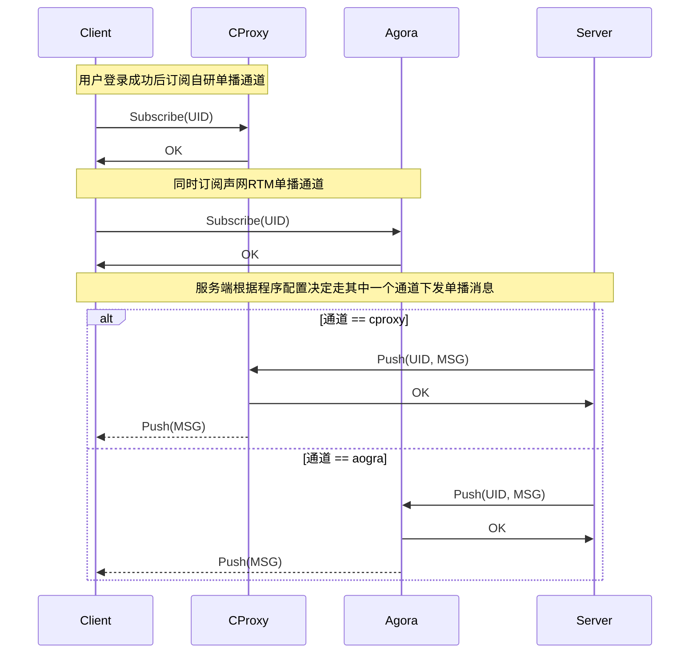
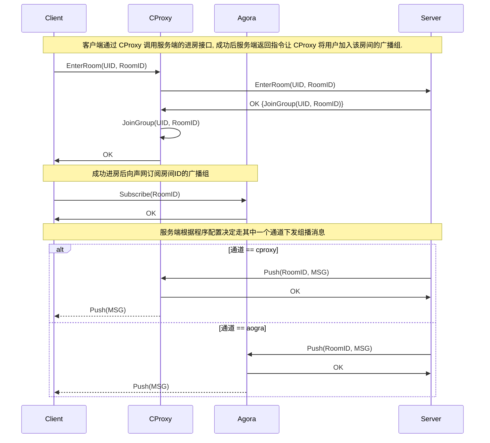

# 单播 & 组播 & 广播

## 设计目标

1. 单个长连接通道故障时支持及时切换
2. 业务可以自行选择长连接通道
3. 对调用方透明
4. 不同通道间有效负载(Payload)结构一致

## 用户单播



## 房间组播



## 全服广播

* 暂不支持, 如果后面有需要则在 CProxy 层实现.

## 协议说明

```protobuf
// 通知消息
message Notify {
  NotifyUserEnter user_enter = 20;
  NotifyUserLeave user_leave = 21;
  // ...
}

// 用户进房
message NotifyUserEnter {
  api.gene.RoomUserInfo user = 1;             // 进入房间用户信息
}

// 用户退房
message NotifyUserLeave {
  api.gene.RoomUserInfo user = 1;               // 离开房间用户信息
}

// ...
```

1. 无论是单播广播, 走 CProxy 还是声网 RTM, 通知消息的有效负载(Payload)的最外层结构都是 Notify.
2. 通过 CProxy 单广播通道下发的 Payload 是 Notify 直接序列化的二进制 Protobuf 数据.
3. 通过声网RTM单广播通道下发的 Payload 是 Notify 序列化成二进制 Protobuf 数据后再标准Base64编码后的字符串.
   ```go 
   notify := &Notify{...}
   protobuf, _ := proto.Marshal(notify)
   payload := base64.StdEncoding.EncodeToString(protobuf)
   ```

## 服务端调用

* 调用处无需关心最终通过哪个通道来下发

```go
package notify

import (
	`context`

	`gitit.cc/social/astrorise/arvoiceroom/proto/pbnotify`
)

// Broadcast 广播
func Broadcast(ctx context.Context, gid string, msg *pbnotify.Notify) error

// Unicast 单播
func Unicast(ctx context.Context, uid int64, msg *pbnotify.Notify) error

```
