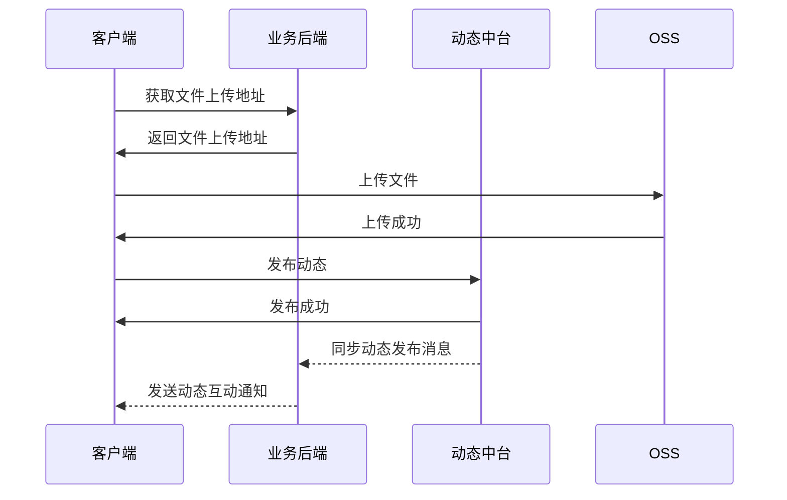
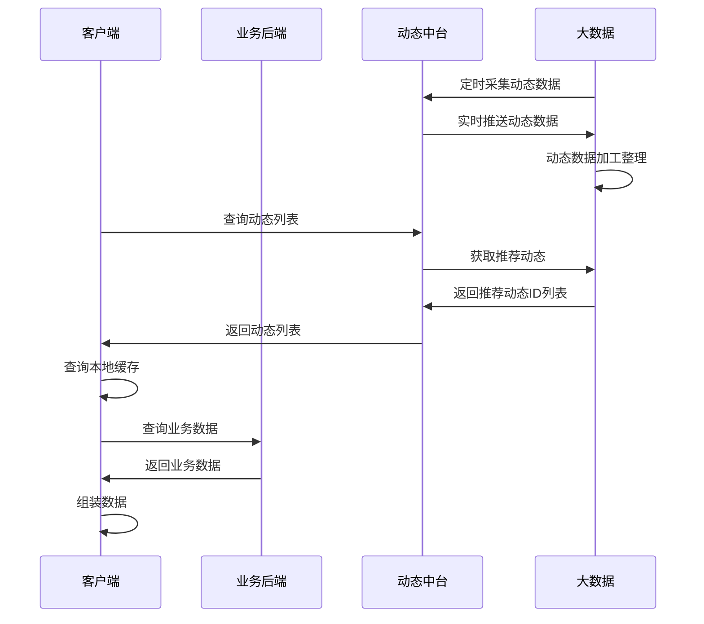
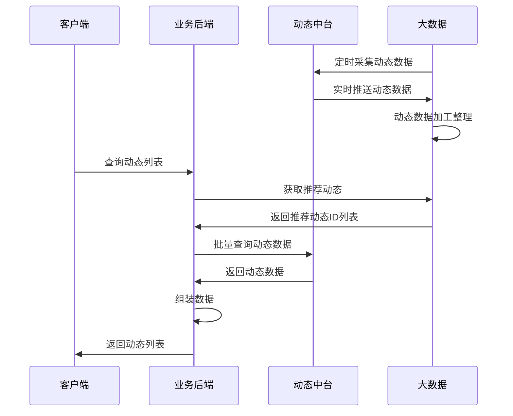
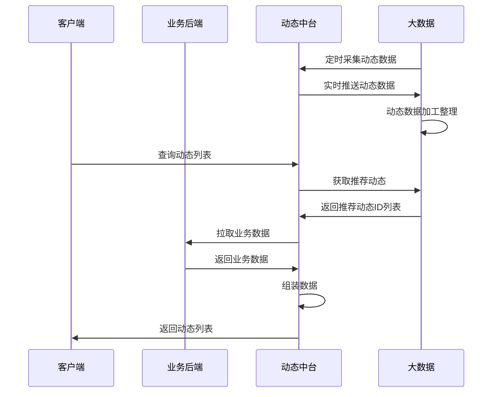
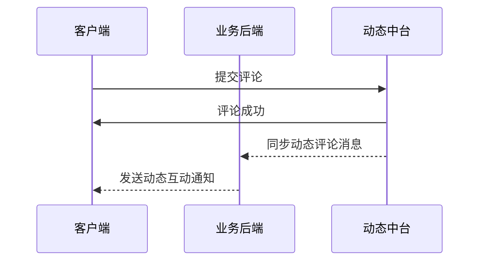
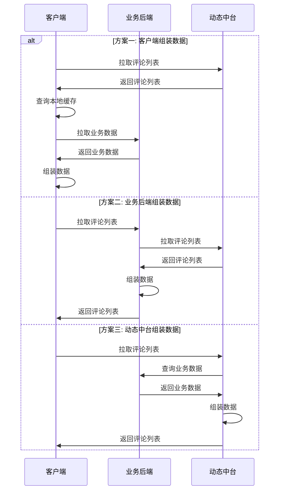

# 社交动态中台设计

## 核心流程

### 发布动态



### 动态列表

因为动态的展示不仅包含动态本身的信息, 也包含业务相关的信息, 例如发布者的信息.
但是动态中台本身并没有业务信息, 而且这块信息在不同的业务之间通常差异比较大, 无法统一处理.

#### 方案一: 由客户端负责组装数据



优点:

* 业务后端和动态中台更加解耦.
* 利用客户端本地缓存可以减少网络带宽, 降低服务端的压力.

缺点:

* 存在未命中缓存的情况下, 客户端需要多发起一次请求.
* 业务后端的定制拓展能力削弱.

#### 方案二: 由业务后端组装数据



优点:

* 业务后端可以控制返回的动态列表, 便于增加 过滤 / 插入 等逻辑.
* 客户端一次性拿到完整的动态数据, 无需二次请求接口获取业务数据再组装.

缺点:

* 业务后端需要实现并包装中台的动态列表的查询接口.
* 业务后端与动态中台耦合, 调用链路更长.

#### 方案三: 由动态中台组装数据



优点:

* 客户端一次性拿到完整的动态数据, 无需二次请求接口获取业务数据再组装.
* 动态中台逻辑更加收拢.

缺点:

* 动态中台需要对接各个业务的大数据以及后端, 增加维护工作量.
* 业务后端的定制拓展能力削弱.

### 评论动态



### 评论列表

评论列表和动态列表存在一样的业务数据组装问题.



## 接口协议

### 动态信息

```protobuf
message Moment {
  int64 moment_id = 1;          // 动态ID
  int64 publish_at = 2;         // 发布时间戳
  int64 uid = 3;                // 发布者UID
  Text text = 10;               // 动态文案
  Attachments attachments = 20; // 动态附件(微信方案, 不允许一个动态里面既包含图片又包含视频.)
  // repeated Attachment attachments = 30; // 动态附件(微博方案, 允许一个动态里面既包含图片又包含视频, 而且可以随意排列组合)
  Statistics statistics = 50;   // 统计信息
  BizData context = 60;         // 透传上下文, 由客户端写入, 用于业务客户端之间或业务客户端和服务端进行能力拓展, 中台只负责存储和传输并不关心其内容及结构.
  BizData expand = 61;          // 拓展信息, 由业务后端写入, 用于业务后端填充此动态的发布者相关信息, 中台只负责存储和传输并不关心其内容及结构.
}
```

### 动态文案

动态文案包含纯文本和富文本主要是为了解决两个问题:

1. 进行互动通知或离线push的时候需要纯文本
2. 新版本支持新的富文本特性时候, 旧版本客户端能最大程度正确显示.

```protobuf
message Text {
  string plain = 1;   // 纯文本，不支持新富文本样式的版本展示纯文本
  string rich = 2;    // 富文本（HTML / Markdown等）
}
```

### 动态附件

动态附件有两种设计方案:

* #### 微信方案(不支持不同种类的附件相互组合)

一个动态要么全部是图片要么只有视频或者只有链接, 即不同种类的附件是不会同时出现的. 这种方案客户端实现起来相对简单,
但是灵活度不高.

* #### 微博方案(支持不同种类的附件互相组合)

一个动态的附件列表支持所有种类的排列组合, 即可以同时包含图片/视频/链接等. 这种方案客户端实现起来相对复杂, 但是灵活度非常高.

由于服务端并不太关心附件的组合关系, 所以这两种方案对服务端的实现难度没什么区别.

```protobuf
// 动态附件类型
enum AttachmentType {
  CONTENT_TYPE_NONE = 0;          // 纯文本(没有附件)
  CONTENT_TYPE_TEXT_IMAGE = 10;   // 纯图片
  CONTENT_TYPE_TEXT_VIDEO = 20;   // 纯视频
  CONTENT_TYPE_TEXT_LINK = 30;    // 纯链接
  // 更多拓展类型
}

// 附件(微信方案)
message Attachments {
  AttachmentType type = 1;    // 附件类型, 不同的内容类型决定着下面的字段是否有值, 例如 "图片" 的时候就只有 images 两字段有值.
  repeated Image images = 10; // 图片列表, 客户端根据图片数量决定排列布局形式.
  repeated Video videos = 20; // 视频, 设计为列表是方便后续拓展成多视频的情况.
  repeated Link links = 30;   // 链接, 设计为列表是方便后续拓展成多链接的情况.
}

// 附件(微博方案)
message Attachment {
  AttachmentType type = 1; // 附件类型

  oneof Media {
    Image image = 10;  // 图片
    Video video = 20;  // 视频
    Link link = 30;    // 链接
    // 更多附件类型
  }
}
```

### 具体附件

```protobuf
// 图片类型
enum ImageType {
  IMAGE_TYPE_NONE = 0;
  IMAGE_TYPE_GENERAL = 10; // 一般图片: jpg / png / webp / ...
  IMAGE_TYPE_GIF = 20;     // gif图片
  IMAGE_TYPE_LIVE = 30;    // 实况图片
  // 更多拓展类型
}

// 图片
message Image {
  ImageType type = 1; // 图片类型
  string url = 2;     // 图片地址
  int32 width = 3;    // 图片宽(像素)
  int32 height = 4;   // 图片高(像素)
}

// 视频类型
enum VideoType {
  VIDEO_TYPE_NONE = 0;
  VIDEO_TYPE_MP4 = 10;   // MP4
  // 更多拓展类型
}

// 视频
message Video {
  VideoType type = 1;       // 视频类型
  string url = 2;           // 视频地址
  string preview_url = 3;   // 预览图片地址
  int32 duration = 4;       // 视频时长(秒)
}

// 链接类型
enum LinkType {
  LINK_TYPE_NONE = 0;
  LINK_TYPE_GENERAL = 10; // 一般链接: http / 应用内跳转 / ...
  // 更多拓展类型
}

// 链接
message Link {
  LinkType type = 1;  // 链接类型
  string icon = 2;    // 图标
  string title = 3;   // 标题
  string url = 4;     // 链接地址
}
```

### 业务数据

动态和评论的业务数据是不同业务之间差异较大的一块, 通常包含动态/评论的发布者的个人信息, 状态信息等.
无法定义一个通用的的数据结构, 又因为动态中台不关心这块数据的内容以及结构, 所以这里设计成字节数组的形式由业务的客户端与服务端来定义.
建议采用 protobuf 来定一个 message, 这样方便维护也能有效的降低传输数据的大小, 也支持 JSON, 但最好不要用 map 这种动态的数据结构.

```protobuf
// 业务数据
message BizData {
  // 数据类型
  enum Type {
    BIZ_DATA_TYPE_NONE = 0;
    BIZ_DATA_TYPE_JSON = 10;     // JSON
    BIZ_DATA_TYPE_PROTOBUF = 20; // Protobuf
    // 更多类型
  }

  Type type = 1;  // 数据类型
  bytes data = 2; // 数据内容
}
```

### 统计信息

```protobuf
message Statistics {
  int64 view_count = 1;     // 浏览量
  int64 comment_count = 2;  // 评论数
}
```

### 动态评论

* 评论分为平铺形式和楼中楼两种形式, 目前大部分 APP 实现都采用 主评 + 跟评 + @人 这种平铺的形式实现,
* 不过为了应对后续别的业务的特殊需求, 中台在设计上对这两种形式都进行支持.
* 对评论的回复也看做是一条评论, 不过这条评论有一个引用评论ID, 也就是 refer_comment_id.
* 对动态的主评的 refer_comment_id == 0.
* 对主评的跟评的 refer_comment_id == 主评ID.
* 两种形式的不同之处在于对跟评的跟评的 refer_comment_id 存哪个评论的ID:
    * 平铺形式: 存的是主评的ID另外通过 refer_uid 指定回复的用户.
    * 楼中楼形式: 存的是跟评的ID, 因为已经是楼中楼的显示形式了, 所以不需要通过 refer_uid 指定回复的用户.

```protobuf
// 动态评论类型
enum CommentType {
  COMMENT_TYPE_NONE = 0;
  COMMENT_TYPE_TEXT = 10;    // 纯文本
  // 更多拓展类型
}

// 动态评论
message Comment {
  int64 comment_id = 1;         // 评论ID
  int64 comment_at = 2;         // 评论时间
  int64 moment_id = 4;          // 动态ID
  int64 uid = 5;                // 评论者UID
  int64 refer_comment_id = 3;   // 对评论的回复也是一条评论, 不过这条评论有一个引用评论ID, 也就是说此值大于0表示这是一条对评论的回复.
  int64 refer_uid = 6;          // 回复某个评论者的UID, 也就是@人.
  CommentType type = 7;         // 评论类型, 这个字段的意义在于后续可以拓展评论支持的内容类型, 目前只有纯文本类型的评论.
  Text text = 10;               // 评论内容
  BizData context = 60;         // 透传上下文, 由客户端写入, 用于业务客户端之间或业务客户端和服务端进行能力拓展, 中台只负责存储和传输并不关心其内容及结构.
  BizData expand = 61;          // 拓展信息, 由业务后端写入, 用于业务后端填充此动态的发布者相关信息, 中台只负责存储和传输并不关心其内容及结构.
}
```

## 待定问题

#### 推荐逻辑是否由大数据计算并提供查询接口?

#### 视频资源是否需要转码/压制, 是否有类似图片一样的压缩裁剪参数?

#### 新版本发布的新特性动态, 例如增加了新的媒体种类, 或者支持了新的图片类型, 旧版本如何兼容和提示.